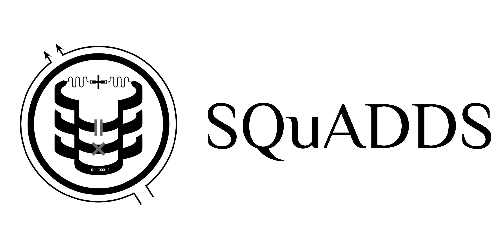

<center>
   <!-- This will stretch the logo to the full container width -->
</center>

# Superconducting Qubit And Device Design and Simulation database     

> :warning: **This project is an alpha release and currently under active development. Some features and documentation may be incomplete. Please update to the latest release.**

The SQuADDS (Superconducting Qubit And Device Design and Simulation) Database Project is an open-source resource aimed at advancing research in superconducting quantum device designs. It provides a robust workflow for generating and simulating superconducting quantum device designs, facilitating the accurate prediction of Hamiltonian parameters across a wide range of design geometries.

**Paper Link:** [SQuADDS: A Database for Superconducting Quantum Device Design and Simulation](https://arxiv.org/pdf/2312.13483.pdf)

**Website Link:** [SQuADDS](https://lfl-lab.github.io/SQuADDS/)

## Table of Contents

- [Installation](#setup)
- [Tutorials](#tutorials)
- [Citation](#citation)
- [Contributing](#contributing)
- [License](#license)
- [FAQs](#faqs)
- [Contact](#contact)
- [Contributors](#contributors)
- [Developers](#developers)

---

## Setup

**Install using pip:**

```bash
pip install SQuADDS
```

**Install from source:**

1. Clone Repository:
   Navigate to your chosen directory and clone the repository.

```bash
cd <REPO-PATH>
git clone https://github.com/LFL-Lab/SQuADDS.git
```

2. Install Dependencies:
   Activate a clean conda environment (with qiskit-metal) and install dependencies.

```bash
conda activate <YOUR-ENV>
cd SQuADDS
pip install -r requirements.txt
pip install -e .
```

**Install on a fresh Mac/Linux system:**

Read more on [install_guide](docs/installation/unix_install.md))

## Tutorials

- [Tutorial 1: Getting Started with SQuADDS](https://lfl-lab.github.io/SQuADDS/source/tutorials/Tutorial-1_Getting_Started_with_SQuADDS.html)
- [Tutorial 2: Simulating Interpolated Designs](https://lfl-lab.github.io/SQuADDS/source/tutorials/Tutorial-2_Simulate_interpolated_designs.html)
- [Tutorial 3: Contributing Experimentally-Validated Simulation Data to the SQuADDS Database](https://lfl-lab.github.io/SQuADDS/source/tutorials/Tutorial-3_Contributing_Validated_Simulation_Data_to_SQuADDS.html)
- [Tutorial 4: Contributing Measured Devices' Data to the SQuADDS Database](https://lfl-lab.github.io/SQuADDS/source/tutorials/Tutorial_4_Contributing_Measured_Data_to_SQuADDS.html)
- [(COMING SOON) More tutorials]()

## Citation

If you use SQuADDS in your research, please cite the following paper:

```bibtex
@article{Shanto2024squaddsvalidated,
  doi = {10.22331/q-2024-09-09-1465},
  url = {https://doi.org/10.22331/q-2024-09-09-1465},
  title = {{SQ}u{ADDS}: {A} validated design database and simulation workflow for superconducting qubit design},
  author = {Shanto, Sadman and Kuo, Andre and Miyamoto, Clark and Zhang, Haimeng and Maurya, Vivek and Vlachos, Evangelos and Hecht, Malida and Shum, Chung Wa and Levenson-Falk, Eli},
  journal = {{Quantum}},
  issn = {2521-327X},
  publisher = {{Verein zur F{\"{o}}rderung des Open Access Publizierens in den Quantenwissenschaften}},
  volume = {8},
  pages = {1465},
  month = sep,
  year = {2024}
}
```

## Contributing

We welcome contributions from the community! Here is our [work wish list](wish_list.md).

Please see our [Contributing Guidelines](CONTRIBUTING.md) for more information on how to get started and absolutely feel free to reach out to us if you have any questions.

## License

This project is licensed under the MIT License - see the [LICENSE](LICENSE) file for details.

## FAQs

Check out our [FAQs](https://lfl-lab.github.io/SQuADDS/source/getting_started.html#faq-s) for common questions and answers.

## Contact

For inquiries or support, please contact [Sadman Ahmed Shanto](mailto:shanto@usc.edu).

## Contributors


| Name               | Institution                        | Contribution                     |
|:-------------------|:-----------------------------------|:---------------------------------|
| Clark Miyamoto     | New York University                | Code contributor                 |
| Madison Howard     | California Institute of Technology | Bug Hunter                       |
| Malida Hecht       | University of Southern California  | Data contributor                 |
| Anne Whelan        | US Navy                            | Documentation contributor        |
| Jenny Huang        | Columbia University                | Documentation contributor        |
| Connie Miao        | Stanford University                | Data Contributor                 |
| Daria Kowsari, PhD | University of Southern California  | Data contributor                 |
| Vivek Maurya       | University of Southern California  | Data contributor                 |
| Haimeng Zhang, PhD | IBM                                | Data contributor                 |
| Ethan Zheng        | University of Southern California  | Data contributor  and Bug Hunter |
| Sara Sussman, PhD  | Fermilab                           | Bug Hunter                       |

## Developers
- [shanto268](https://github.com/shanto268) - 245 contributions
- [elizabethkunz](https://github.com/elizabethkunz) - 17 contributions
- [NxtGenLegend](https://github.com/NxtGenLegend) - 1 contributions
- [ethanzhen7](https://github.com/ethanzhen7) - 1 contributions
---

