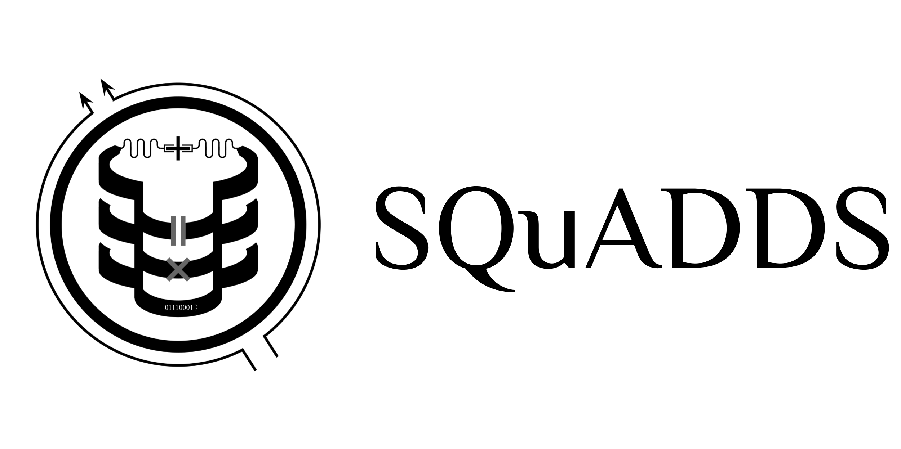

<center>
  
</center>

# Superconducting Qubit And Device Design and Simulation Database     [](https://arxiv.org/abs/2312.13483) 

> :warning: **This project is an alpha release and currently under active development. Some features and documentation may be incomplete. Please update to the latest release.**

The SQuADDS (Superconducting Qubit And Device Design and Simulation) Database Project is an open-source resource aimed at advancing research in superconducting quantum device designs. It provides a robust workflow for generating and simulating superconducting quantum device designs, facilitating the accurate prediction of Hamiltonian parameters across a wide range of design geometries.

**Paper Link:** [SQuADDS: A Database for Superconducting Quantum Device Design and Simulation](https://quantum-journal.org/papers/q-2024-09-09-1465/)

**Docsite Link:** [https://lfl-lab.github.io/SQuADDS/](https://lfl-lab.github.io/SQuADDS/)

**Hugging Face Link:** [https://huggingface.co/datasets/SQuADDS/SQuADDS_DB](https://huggingface.co/datasets/SQuADDS/SQuADDS_DB)

**Contribution Portal Link:** [https://squadds-portal.vercel.app](https://squadds-portal.vercel.app)

**Chat with the Codebase:** [https://deepwiki.com/LFL-Lab/SQuADDS/1-overview](https://deepwiki.com/LFL-Lab/SQuADDS/1-overview)

## Table of Contents

- [Citation](#citation)
- [Installation](#installation)
  - [Install from Source](#install-from-source-recommended-for-development)
  - [Install using pip](#install-using-pip)
  - [Run using Docker](#run-using-docker)
- [Tutorials](#tutorials)
- [MCP Server (AI Agent Integration)](#mcp-server-ai-agent-integration)
- [ML Models](#ml-models)
- [Contributing](#contributing)
- [License](#license)
- [FAQs](#faqs)
- [Contact](#contact)
- [Contributors](#contributors)
- [Developers](#developers)

---

## Citation

If you use SQuADDS in your research, please cite the following paper:

```bibtex
@article{Shanto2024squaddsvalidated,
  doi = {10.22331/q-2024-09-09-1465},
  url = {https://doi.org/10.22331/q-2024-09-09-1465},
  title = {{SQ}u{ADDS}: {A} validated design database and simulation workflow for superconducting qubit design},
  author = {Shanto, Sadman and Kuo, Andre and Miyamoto, Clark and Zhang, Haimeng and Maurya, Vivek and Vlachos, Evangelos and Hecht, Malida and Shum, Chung Wa and Levenson-Falk, Eli},
  journal = {{Quantum}},
  issn = {2521-327X},
  publisher = {{Verein zur F{\"{o}}rderung des Open Access Publizierens in den Quantenwissenschaften}},
  volume = {8},
  pages = {1465},
  month = sep,
  year = {2024}
}
```

---

## Installation

SQuADDS uses [uv](https://docs.astral.sh/uv/) for fast, reliable Python package management.

### Prerequisites

Install `uv` (if you don't have it already):

```bash
curl -LsSf https://astral.sh/uv/install.sh | sh
```

### Install from Source (Recommended for Development)

```bash
git clone https://github.com/LFL-Lab/SQuADDS.git
cd SQuADDS
uv sync
```

Verify the installation:

```bash
uv run python -c "import squadds; print(squadds.__file__)"
```

### Install using pip

```bash
pip install SQuADDS
```

### Optional Dependencies

Install GDS processing tools:

```bash
uv sync --extra gds
```

Install documentation tools:

```bash
uv sync --extra docs
```

Install development tools:

```bash
uv sync --extra dev
```

Install contribution tools (for contributing data to SQuADDS):

```bash
uv sync --extra contrib
```

Install all optional dependencies:

```bash
uv sync --all-extras
```

### Setting up Jupyter Notebook

To use SQuADDS in Jupyter notebooks (including VS Code/Cursor), register the kernel:

```bash
uv sync --extra dev  # Installs ipykernel
uv run python -m ipykernel install --user --name squadds --display-name "SQuADDS (uv)"
```

Then select **"SQuADDS (uv)"** as your kernel in Jupyter/VS Code/Cursor.

### Run using Docker:

<details>
<summary>Click to expand/hide Docker instructions</summary>
<br>

We provide a pre-built Docker image that contains all dependencies, including `Qiskit-Metal` and the latest `SQuADDS` release.

#### Pull the Latest Docker Image

You can pull the latest image of **SQuADDS** from GitHub Packages:

```bash
docker pull ghcr.io/lfl-lab/squadds_env:latest
```

If you'd like to pull a specific version (support begins from `v0.3.4` onwards), use the following command:

```bash
docker pull ghcr.io/lfl-lab/squadds_env:v0.3.4
```

You can find all available versions and tags for the **squadds_env** Docker image on [LFL-Lab Packages](https://github.com/LFL-Lab?tab=packages&repo_name=SQuADDS).

#### Run the Docker Container

After pulling the image, you can run the container using:

```bash
docker run -it ghcr.io/lfl-lab/squadds_env:latest /bin/bash
```

This will give you access to a bash shell inside the container.

#### Activate the Conda Environment

Inside the container, activate the `squadds-env` environment:

```bash
conda activate squadds-env
```

#### Run SQuADDS

Once the environment is active, you can run **SQuADDS** by executing your Python scripts or starting an interactive Python session.

</details>

---

## Tutorials

The following tutorials are available to help you get started with `SQuADDS`:

- [Tutorial 0: Using the SQuADDS WebUI](https://lfl-lab.github.io/SQuADDS/source/tutorials/Tutorial-0_Using_the_SQuADDS_WebUI.html)
- [Tutorial 1: Getting Started with SQuADDS](https://lfl-lab.github.io/SQuADDS/source/tutorials/Tutorial-1_Getting_Started_with_SQuADDS.html)
- [Tutorial 2: Simulating Interpolated Designs](https://lfl-lab.github.io/SQuADDS/source/tutorials/Tutorial-2_Simulate_interpolated_designs.html)
- [Tutorial 3: Contributing Experimentally-Validated Simulation Data to the SQuADDS Database](https://lfl-lab.github.io/SQuADDS/source/tutorials/Tutorial-3_Contributing_Validated_Simulation_Data_to_SQuADDS.html)
- [Tutorial 4: Contributing Measured Devices' Data to the SQuADDS Database](https://lfl-lab.github.io/SQuADDS/source/tutorials/Tutorial_4_Contributing_Measured_Data_to_SQuADDS.html)
- [Tutorial 5: Designing a "fab-ready" chip with SQuADDS](https://lfl-lab.github.io/SQuADDS/source/tutorials/Tutorial-5_Designing_a_fab_ready_chip_with_SQuADDS.html)
- [Tutorial 6: Adding Airbridges](https://lfl-lab.github.io/SQuADDS/source/tutorials/Tutorial-6_Adding_Airbridges.html)
- [Tutorial 7: Simulate designs with palace](https://lfl-lab.github.io/SQuADDS/source/tutorials/Tutorial-7_Simulate_designs_with_palace.html)
- [Tutorial 8: ML Interpolation in SQuADDS](https://lfl-lab.github.io/SQuADDS/source/tutorials/Tutorial-8_ML_interpolation_in_SQuADDS.html)
- [Tutorial 9: Learning the Inverse Map](https://lfl-lab.github.io/SQuADDS/source/tutorials/Tutorial-9_Learing_the_Inverse_Design_Map.html)
- [Tutorial 10: HFSS Driven-Modal Capacitance Extraction](https://lfl-lab.github.io/SQuADDS/source/tutorials/Tutorial-10_DrivenModal_Capacitance_Extraction.html)
- [Tutorial 11: Unified Driven-Modal Hamiltonian Extraction](https://lfl-lab.github.io/SQuADDS/source/tutorials/Tutorial-11_DrivenModal_Combined_Hamiltonian_Extraction.html)

---

## MCP Server (AI Agent Integration)

SQuADDS includes a built-in **Model Context Protocol (MCP)** server that lets AI coding agents interact with the entire database — searching designs, interpolating parameters, and exploring components — through a standardized protocol.

### Agent Setup (Copy-Paste This to Your AI Agent)

> **If you're using an AI coding assistant**, just paste this prompt to have it set up SQuADDS MCP for you:

<details>
<summary><strong>Click to copy the agent setup prompt</strong></summary>

```
I need you to set up the SQuADDS MCP server so I can access the superconducting
qubit design database through you. Here's what to do:

1. Clone the repo and install:
   git clone https://github.com/LFL-Lab/SQuADDS.git
   cd SQuADDS
   uv sync --extra mcp

2. Add the MCP server to your config. The command to run the server is:
   uv run --directory /path/to/SQuADDS squadds-mcp

3. Once connected, read the `squadds://guide` resource for a quick overview
   of available tools.

The server exposes these key tools:
- `list_components` / `list_datasets` — explore the database
- `find_closest_designs` — find designs matching target Hamiltonian parameters
- `interpolate_design` — get physics-interpolated designs
- `get_hamiltonian_param_keys` — discover valid search parameters

Typical target parameter ranges:
- qubit_frequency_GHz: 3–8
- anharmonicity_MHz: −500 to −50
- cavity_frequency_GHz: 5–12
- kappa_kHz: 10–1000
- g_MHz: 10–200

Please set this up and confirm you can access the SQuADDS tools.
```

</details>

### Manual Setup

#### Install

```bash
git clone https://github.com/LFL-Lab/SQuADDS.git
cd SQuADDS
uv sync --extra mcp
```

#### Run

```bash
# stdio mode (for local AI assistants)
uv run squadds-mcp

# HTTP mode (for networked/remote usage)
SQUADDS_MCP_TRANSPORT=streamable-http uv run squadds-mcp
```

#### Connect Your AI Client

<details>
<summary><strong>Claude Desktop</strong></summary>

Add to `claude_desktop_config.json`:
```json
{
  "mcpServers": {
    "squadds": {
      "command": "uv",
      "args": ["run", "--directory", "/path/to/SQuADDS", "squadds-mcp"]
    }
  }
}
```
</details>

<details>
<summary><strong>Claude Code</strong></summary>

```bash
claude mcp add squadds -- uv run --directory /path/to/SQuADDS squadds-mcp
```
</details>

<details>
<summary><strong>Cursor</strong></summary>

Add to `.cursor/mcp.json` in your project:
```json
{
  "mcpServers": {
    "squadds": {
      "command": "uv",
      "args": ["run", "--directory", "/path/to/SQuADDS", "squadds-mcp"]
    }
  }
}
```
</details>

<details>
<summary><strong>VS Code (Copilot)</strong></summary>

Add to `.vscode/settings.json`:
```json
{
  "mcp": {
    "servers": {
      "squadds": {
        "command": "uv",
        "args": ["run", "--directory", "/path/to/SQuADDS", "squadds-mcp"]
      }
    }
  }
}
```
</details>

<details>
<summary><strong>Antigravity (Gemini)</strong></summary>

Add to `~/.gemini/settings.json` (or project-level `.gemini/settings.json`):
```json
{
  "mcpServers": {
    "squadds": {
      "command": "uv",
      "args": ["run", "--directory", "/path/to/SQuADDS", "squadds-mcp"]
    }
  }
}
```
</details>

<details>
<summary><strong>Gemini CLI</strong></summary>

Add to `~/.gemini/settings.json`:
```json
{
  "mcpServers": {
    "squadds": {
      "command": "uv",
      "args": ["run", "--directory", "/path/to/SQuADDS", "squadds-mcp"]
    }
  }
}
```
</details>

<details>
<summary><strong>OpenAI Codex CLI</strong></summary>

```bash
codex --mcp-config mcp.json
```

With `mcp.json`:
```json
{
  "mcpServers": {
    "squadds": {
      "command": "uv",
      "args": ["run", "--directory", "/path/to/SQuADDS", "squadds-mcp"]
    }
  }
}
```
</details>

**Full MCP documentation:** [MCP_README.md](MCP_README.md) | **Developer guide:** [MCP_DEVELOPER_GUIDE.md](MCP_DEVELOPER_GUIDE.md)

---

## ML Models

We host ML models trained on SQuADDS on our [Hugging Face org](https://huggingface.co/SQuADDS), served through the [SQuADDS ML Inference API Space](https://huggingface.co/spaces/SQuADDS/squadds-ml-inference-api). Docsite page: [ML Models](https://lfl-lab.github.io/SQuADDS/source/ml_models.html).

Our first production model is a **qubit-claw (TransmonCross) Hamiltonian-to-geometry inverse** model, developed in collaboration with Taylor Patti, Nicola Pancotti, Enectali Figueroa-Feliciano, Sara Sussman, Olivia Seidel, Firas Abouzahr, Eli Levenson-Falk, and Sadman Ahmed Shanto — with **Olivia Seidel and Firas Abouzahr** as the primary trainers.

<details>
<summary><strong>transmon_cross_hamiltonian_inverse — usage</strong></summary>

- Model repo: <https://huggingface.co/SQuADDS/transmon-cross-hamiltonian-inverse>
- Space / live API: <https://squadds-squadds-ml-inference-api.hf.space>
- Routes: `GET /health`, `GET /models`, `POST /predict`

Recommended agent flow: `GET /models` → pick a model with `status="ready"` → `POST /predict` with that `model_id` and the exact input keys it advertises.

```bash
curl -X POST \
  https://squadds-squadds-ml-inference-api.hf.space/predict \
  -H 'Content-Type: application/json' \
  -d '{"model_id":"transmon_cross_hamiltonian_inverse","inputs":{"qubit_frequency_GHz":4.85,"anharmonicity_MHz":-205.0}}'
```

Inputs: `qubit_frequency_GHz`, `anharmonicity_MHz`.
Outputs (SI units, meters): `design_options.connection_pads.readout.claw_length`, `design_options.connection_pads.readout.ground_spacing`, `design_options.cross_length`. Feed those straight into SQuADDS / Qiskit Metal downstream flows.

Full contract, sample response, and manifest: see the [model repo README](https://huggingface.co/SQuADDS/transmon-cross-hamiltonian-inverse) and the [Space README](https://huggingface.co/spaces/SQuADDS/squadds-ml-inference-api).

</details>

More models are coming — resonator and qubit-cavity coupled-system inverses are next (the deployment tooling already knows about these families, so they drop in once checkpoints land). **If you've trained a well-performing SQuADDS-based model, please PR it in** — open an issue or PR against [SQuADDS/squadds-ml-inference-api](https://huggingface.co/spaces/SQuADDS/squadds-ml-inference-api) and we'll get it on the model page.

---

## Contributing

We welcome contributions from the community! Here is our [work wish list](wish_list.md).

You can use our [web portal](https://squadds-portal.vercel.app) to contribute your files - [https://squadds-portal.vercel.app](https://squadds-portal.vercel.app)

Please see our [Contributing Guidelines](CONTRIBUTING.md) for more information on how to get started and absolutely feel free to reach out to us if you have any questions.

---

## License

This project is licensed under the MIT License - see the [LICENSE](LICENSE) file for details.

---

## FAQs

Check out our [FAQs](https://lfl-lab.github.io/SQuADDS/source/getting_started.html#faq-s) for common questions and answers.

---

## Contact

For inquiries or support, please contact [Sadman Ahmed Shanto](mailto:shanto@usc.edu).

---

## Contributors


| Name                  | Institution                                            | Contribution                         |
|:----------------------|:-------------------------------------------------------|:-------------------------------------|
| Clark Miyamoto        | New York University                                    | Code contributor                     |
| Madison Howard        | California Institute of Technology                     | Bug Hunter                           |
| Evangelos Vlachos     | University of Southern California                      | Code contributor                     |
| Kaveh Pezeshki        | Stanford University                                    | Documentation contributor            |
| Anne Whelan           | US Navy                                                | Documentation contributor            |
| Jenny Huang           | Columbia University                                    | Documentation contributor            |
| Connie Miao           | Stanford University                                    | Data Contributor                     |
| Malida Hecht          | University of Southern California                      | Data contributor                     |
| Daria Kowsari, PhD    | University of Southern California                      | Data contributor                     |
| Vivek Maurya          | University of Southern California                      | Data contributor                     |
| Haimeng Zhang, PhD    | IBM                                                    | Data contributor                     |
| Elizabeth Kunz        | University of Southern California                      | Documentation  and  Code contributor |
| Adhish Chakravorty    | University of Southern California                      | Documentation  and  Code contributor |
| Ethan Zheng           | University of Southern California                      | Data contributor  and Bug Hunter     |
| Sara Sussman, PhD     | Fermilab                                               | Bug Hunter                           |
| Priyangshu Chatterjee | IIT Kharagpur                                          | Documentation contributor            |
| Abhishek Chakraborty  | Chapman University/University of Rochester and Riggeti | Code contributor                     |
| Saikat Das            | University of Southern California                      | Reviewer                             |
| Firas Abouzahr        | Northwestern                                           | Bug Hunter                           |

## Developers
- [shanto268](https://github.com/shanto268) - 440 contributions
- [elizabethkunz](https://github.com/elizabethkunz) - 17 contributions
- [LFL-Lab](https://github.com/LFL-Lab) - 9 contributions
- [NxtGenLegend](https://github.com/NxtGenLegend) - 1 contributions
- [ethanzhen7](https://github.com/ethanzhen7) - 1 contributions
- [PCodeShark25](https://github.com/PCodeShark25) - 1 contributions
---
